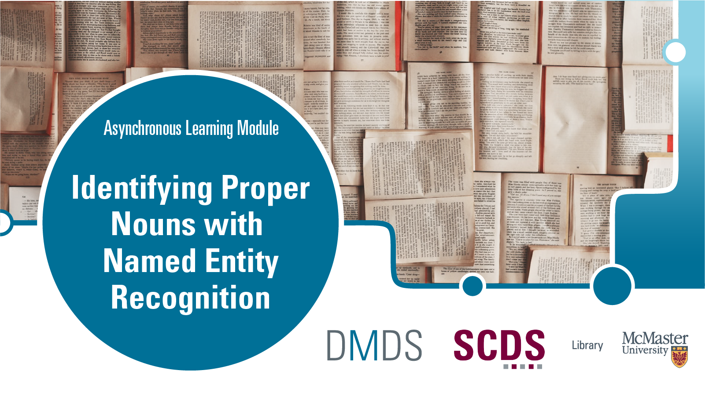

# Identifying Proper Nouns with Named Entity Recognition

***Identifying Proper Nouns with Named Entity Recognition* belongs to a series of workshops on computational text analysis.**

Names - of people or places, for instance - are a common feature of interest when working with texts at scale. We can use a search function to locate occurrences of names that we are expecting to find, such as "Frederick Douglass" in issues of *The North Star*, but how do we go about searching for all names in the text - even those we do not know to look for?

The natural language processing technique of named entity recognition (NER) identifies words - or *tokens* - that may be names, places, or organizations within unstructured text. Some NER tools will also identify tokens that may represent dates, currency and so on. It can support exploratory data analysis, highlighting entities for further investigation through close reading or produce a list of entities that can then be counted and compared. 

In this workshop, we will explore how NER works and apply it to a text corpus using a Python library named SpaCy.

## Prerequisites
* Basic computer literacy (creating and working with different file types, navigating interfaces, using shortcut keys and so on)

## Learning Objectives
By the end of the workshop, you will be able to:
* Describe how NER identifies possible entities within a text corpus
* Identify potential names, places and organizations using NER tools
* Explain why different NER tools may produce different results from each other

## Duration
Going through the workshop from start to finish (and you need not necessarily!) will take you approximately 1 hour to complete, depending on your familiarity with Python and whether you are working with your own dataset alongside the sample corpus.

## Land Acknowledgement

McMaster University is situated in Ohròn:wakon which is the traditional territories of the Erie, Neutral, Huron-Wendat, Haudenosaunee and Mississaugas. This land is covered by the “Dish With One Spoon Wampum Belt Covenant”, an agreement between the Haudenosaunee confederacy and Anishinaabe nations to ensure those who live here take only what they need, leave enough in the dish for others, and keep the dish clean. This land is also covered by the Between the Lakes Treaty of 1792 and is very close to the 1784 Haldimand Treaty, which holds the land six miles to each side of the Grand River as a tract for Six Nations, which is currently not being honored. 

Many of us at the Sherman Centre took the First Nations' Information Governance Centre's OCAP course this past year which stands for Ownership, Control, Access, and Possession. We encourage you to learn [more about OCAP](https://fnigc.ca/ocap-training/take-the-course/) and Indigenous data management practices more broadly, including the [OCAS principles](https://u.mcmaster.ca/ocas-framework) endorsed by the Manitoba Métis Federation, the principles of [Inuit Qaujimajatuqangit](https://doi.org/10.1139/as-2020-0015), ᐃᓄᐃᑦ ᑕᐱᕇᑦ ᑲᓇᑕᒥ (Inuit Tapiriit Kanatami) [National Inuit Strategy on Research](https://www.itk.ca/national-strategy-on-research-launched/), and Global Indigenous Data Alliance’s [CARE principles](https://www.gida-global.org/care). 
