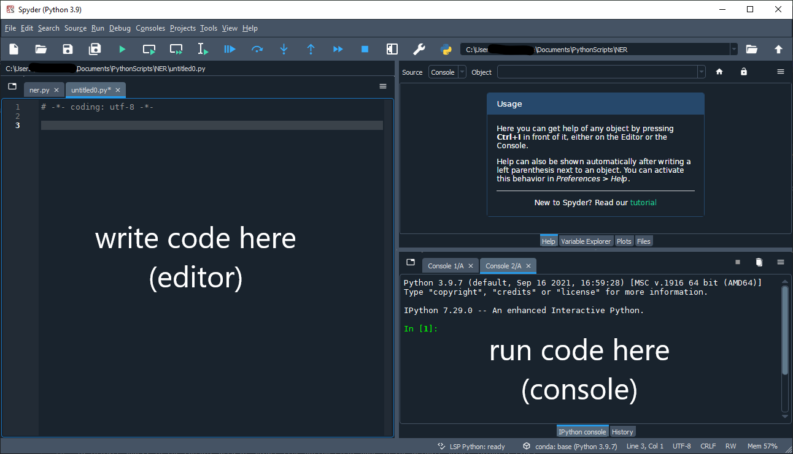
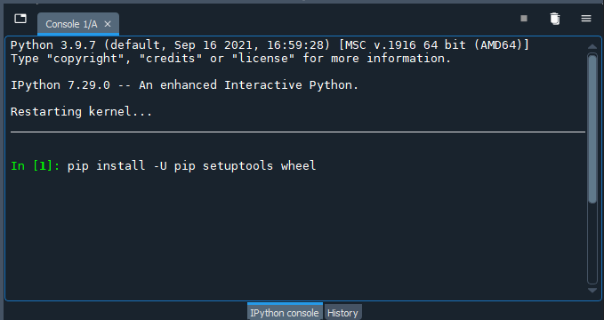
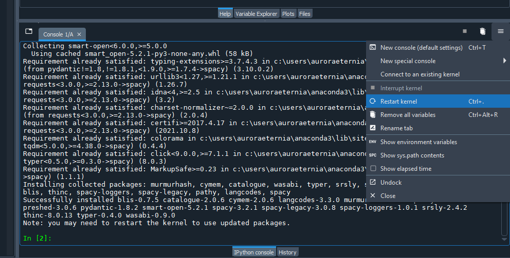
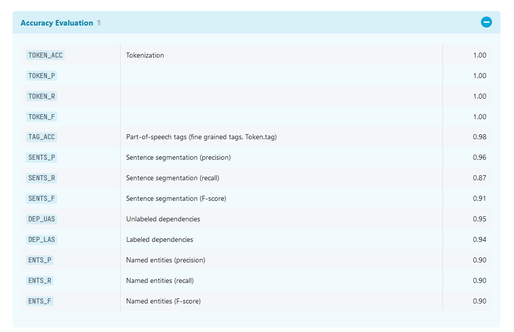
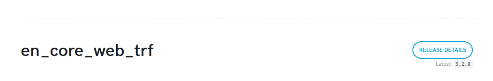
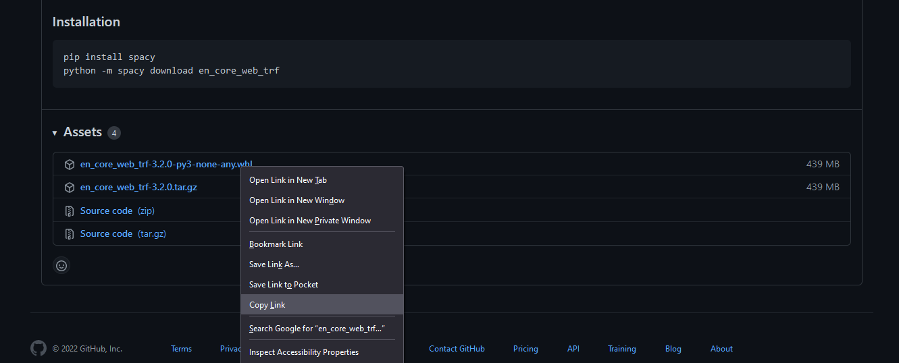

# Installing SpaCy

## What is SpaCy?

[SpaCy](https://spacy.io/usage/spacy-101/) is a Python library for advanced natural language processing. We will be using SpaCy within the Python script we create to save us the time and labour of writing hundreds or thousands of lines of code. 

Another widely used platform for natural language processing with Python is NLTK, or [Natural Language Toolkit](https://www.nltk.org/), which connects you to a suite of resources and libraries to work with language data. SpaCy's pre-built workflow automates much of what you have to write explicitly in NLTK, such as tokenizing words and PoS tagging. Because SpaCy's developers have made design decisions for us, they have been able to optimize the workflow so that it performs many - but not all - NLP tasks more quickly than NLTK. 

The trade-off here is that you have less control over what occurs in the workflow. While you can adjust some parameters in SpaCy, you may find that NLTK is a better for certain tasks. If you are interested in finding out more about NLTK, we encourage you to explore Alex Provo and Jay Brodeur's [text analysis lesson using NLTK](https://jasonbrodeur.github.io/dsi-text-prep/python.html#6-removing-stop-words-with-nltk--putting-it-all-together).

\[video - installing spacy and language models]

## Installing the SpaCy library

We will begin by installing the SpaCy library so that we can use it in our script. Start by opening Anaconda and then launching Spyder, the integrated development environment - or IDE - that we will use to write our Python script.

In the default layout for Spyder, the editor is on the left-side pane - we will write our script in the editor. On the bottom right-side pane is the console, which is where we will execute our script, type individual commands and get feedback from Spyder on what is happening with our script.

We will learn about other features and shortcut keys in Spyder as we work through the lesson. If you would like a more comprehensive introduction to Spyder, [the developer's documentation](https://docs.spyder-ide.org/current/quickstart.html) is a great place to start.

First, SpaCy's documentation recommends to update the Python packages that will help to install SpaCy. If you have downloaded Anaconda very recently, the packages may already be up-to-date - but it is good to check! 

In the console area of Spyder - i.e. the bottom-right pane in the default Spyder layout - type:

`pip install -U pip setuptools wheel`

Hit `Enter` (Windows) / `Return` (Mac) to run the command. Spyder will let you know in the console the status of your update command. 

You may be instructed to restart the kernel - or refresh the console by erasing previous variables and data - which you can do by going to the "Options" menu at the top-right of the console or using `Ctrl` / `cmd` and `.` as the shortcut keys.

With our environment updated, we will now install SpaCy by typing into the console as we did in the previous step:

`pip install -U spacy`

The most recent version of SpaCy will be installed with the above command. The console may indicate that other dependencies are required and will often install them for you. Assuming that SpaCy has been installed successfully, you will again be instructed by the console to restart the kernel.

If you encounter errors in the install process, you may wish to consult the [SpaCy documentation](https://spacy.io/usage#quickstart) or [reach out to the Sherman Centre](mailto:scds@mcmaster.ca). 

## Installing language models

SpaCy provides trained language models, which - to recall from "[How Does NER Work?](ner.html)" - are required to perform tasks that are difficult to program explicitly like lemmatization, dependency parsing and named entity recognition. While using a pre-trained model saves us the time of training our own, there are likely to be biases and other shortcomings in the model which are hidden from us.

SpaCy's models are trained on texts from the web, like blog posts, news articles and comments. You can [train your own model](https://spacy.io/usage/training) with SpaCy if you are working with a corpus for which SpaCy's existing models are inadequate. Be warned, though - there is considerable labour involved in annotating training data to produce robust models!

For the purposes of the lesson, we will use SpaCy's trained language models. There are actually four English language models to choose from, with different strengths and limitations. 

The English transformer pipeline, *en_core_web_trf*, has the highest accuracy score for NER - 0.90, as depicted in the screenshot below - and so, will be what we use in the lesson. Take a moment to [review the four models](https://spacy.io/models/en) to get a sense of how they were created and what tasks they are best suited for. 

To install the model, type the command below into the console:

`python -m spacy download en_core_web_trf`

If the above command returns an error, you can alternatively install the model directly using the link to it from GitHub:

`pip install https://github.com/explosion/spacy-models/releases/download/en_core_web_trf-3.2.0/en_core_web_trf-3.2.0-py3-none-any.whl`

At the time of authoring (January 2022), the *en_core_web_trf* model was in version 3.2.0, which is reflected in the GitHub URL. Verify that it is the most recent version by referring to the documentation on SpaCy's website.

The "RELEASE DETAILS" link will take you to the GitHub repository for the model, where you can download the more recent data from the "Assets" area of the repository.

If you need to update the model version, copy the link to the newer wheel file (.whl) from GitHub and replace the URL in your own install command.

We are now ready to use SpaCy in our script! You only have to install SpaCy and the language model once, but if you take a break from your NER analysis and want to use SpaCy again after a while, we recommend that you update your version of SpaCy and the language model following the same instructions.

 
Next --> [Create the NLP object](object.html)
