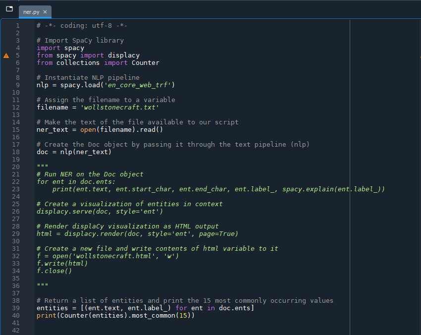
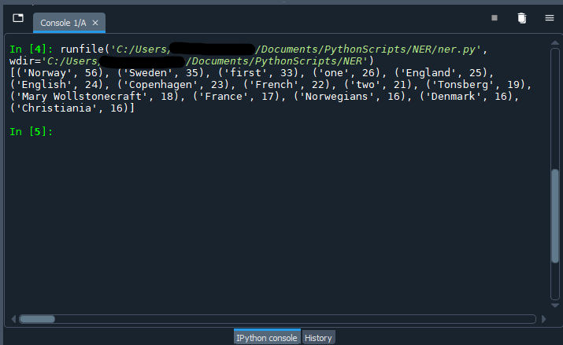
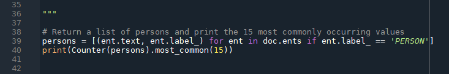
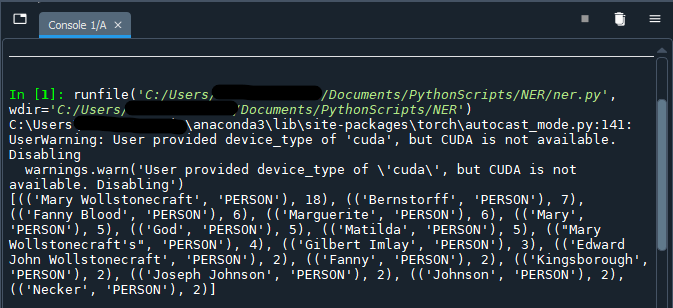
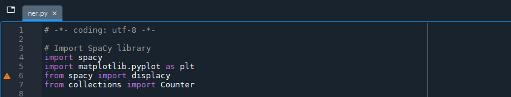
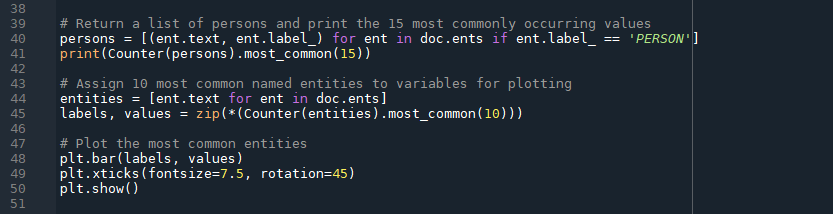
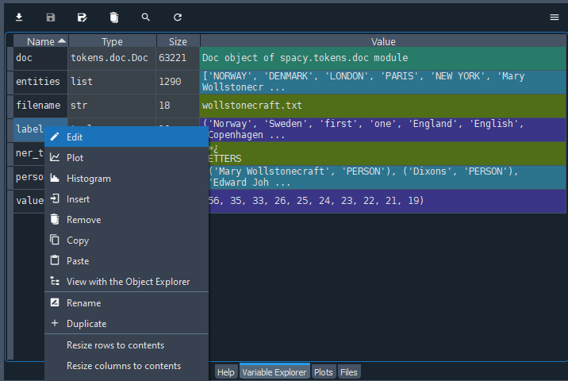
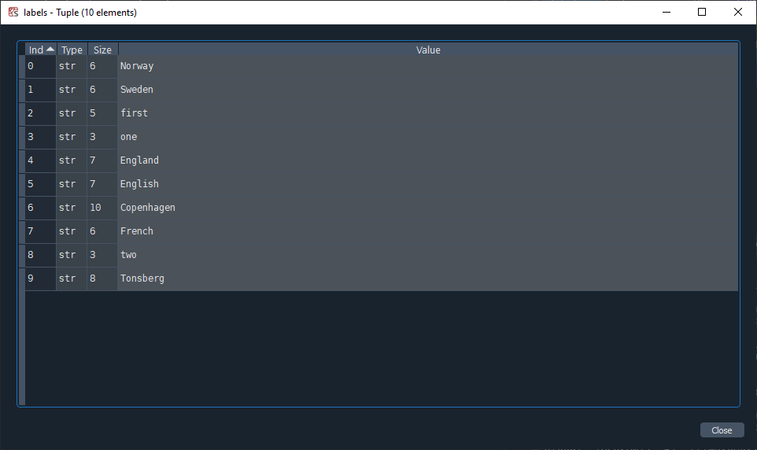
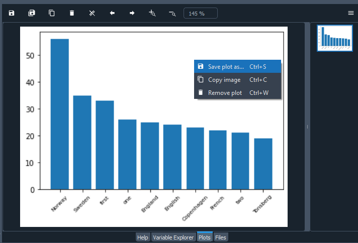
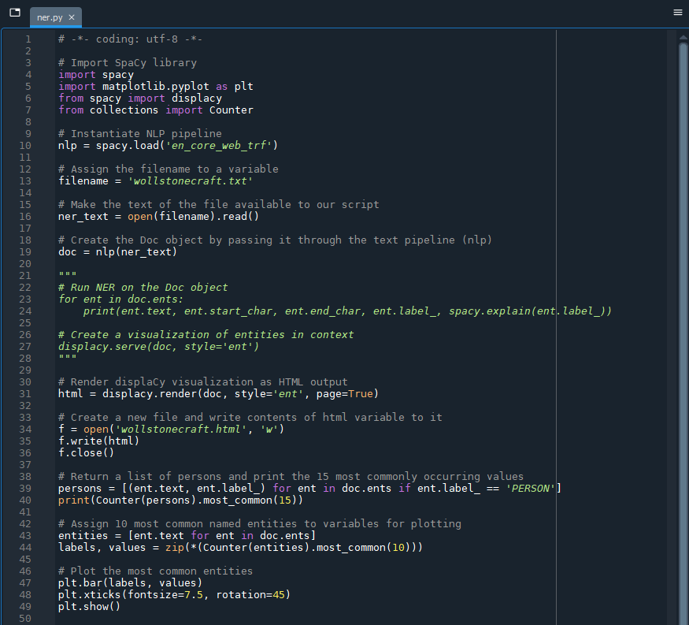

# 4 .Identifying Key Terms

We have an overall sense of the named entities in our document - but which ones appear most frequently? We can draw from an existing Python module, `collections`, to count our named entities.

## Counting named entities

**4.1.** The `collections` module is built in to Python, so we do not need to install it as we did with SpaCy. We do, however, need to let Python know that we want to use it. Underneath `from spacy import displacy`, write:

```
from collections import Counter
```

<hr />

**4.2.** Then, at the end of the ner.py script:

```
# Return a list of named entities and print the 15 most commonly occurring values
entities = [(ent.text, ent.label_) for ent in doc.ents]
print(Counter(entities).most_common(15))
```

Again, we can comment out the code from the previous step where we created an HTML file visualizing named entities for the time being. In Spyder, you may receive a code analysis warning next to `from spacy import displacy` because you are no longer using displaCy at all in the script. You can ignore it!



Run the script (`F5`), which will return the 15 most frequently occurring entities as well as the entity type label. You can adjust the number of entities by changing the argument (value) of `.most_common()`.



<hr />

**4.3.** You can also limit the scope of the count to a specific entity type - if you are only interested in persons mentioned, for example.

After `doc.ents`, add `if ent.label_ == 'PERSON'` to limit the results to named entities of the type 'PERSON' only. We will assign the returned values to the variable `persons` to more accurately reflect the output.

```
# Return a list of persons and print the 15 most commonly occurring values
persons = [(ent.text, ent.label_) for ent in doc.ents if ent.label_ == 'PERSON']    
print(Counter(persons).most_common(15))
```



The results returned should be limited to the names of persons; including `ent.label_` in our statement allows us to verify our results (as well as getting a peek at the aformentioned "CUDA device" error):



Using the entity types from "[Interpreting the results](https://scds.github.io/text-analysis-2/visualize.html#interpreting-the-results)" on the previous page, you can change the value of `ent.label_` to return a list of events or places, alternatively.

> ***Caveat: on the limits of counting in computational text analysis***
> 
> *Although counting terms in a corpus can point us towards avenues for further investigation, there are numerous points within the text analysis workflow that may lead to inaccurate counts: OCR errors, variations in spelling, mis- or missed classification by SpaCy and so on. Not to mention that we do not know the manner in which terms are used without verifying the context of their appearance. All to say: counts can be unreliable, so delve deeper into the corpus before making any claims about the text!*

## Visualizing relative weights of key terms

Visualizations are often used in exploratory data analysis as they can quickly convey information about the data to sighted folks. In addition to the visualizers in SpaCy, which are limited to dependencies and named entities, we can draw on other Python libraries like Matplotlib.

If you are using the Anaconda environment as the launchpad for Spyder, Matplotlib should already be installed.

<hr />

**4.4.** As with `collections` module, we will import Matplotlib with our other import statements at the beginning of the script:

```
import spacy
import matplotlib.pyplot as plt
from spacy import displacy
from collections import Counter
```



<hr />

**4.5.** With Matplotlib imported as the shorthand variable `plt`, we will start to build out our visualization. The first step is to gather the data we are going to visualize. Here, we will return to our earlier statement about returning the most commonly occurring named entities (not just persons). To avoid crowding, we can limit the number of results to 10.

```
# Assign 10 most common named entities to variables "labels" and "values" for plotting
entities = [ent.text for ent in doc.ents]
labels, values = zip(*(Counter(entities).most_common(10)))
```

The code above creates a variable of the list type called `entities` that we are assigning to the labels and values of a bar chart, respectively.

<hr />

**4.5.** Next, we will plot the most common entities and their counts in a simple bar graph:

```
# Plot the most common entities
plt.bar(labels, values)
plt.xticks(fontsize=7.5, rotation=45)
plt.show()
```



Run the script - as usual, it will take some time! When the console has processed your script, the plot will appear in the "Plots" tab within the same pane as the Variable Explorer. The labels are quite tiny for the purpose, ironically, of being able to read them more easily by avoiding overlap. We can refer back to "entities" in the Variable Explorer if any of them are unclear.



Although we do not have the counts to refer to in the "labels" variable, the label names will be arranged from largest to smallest count size.



You can save the plot as a PNG file directly from the "Plots" tab in Spyder. Right click on the plot and select "Save plot as..." (`Ctrl` / `cmd` + `S`).



The plot output is unlikely to win any visualization beauty contests but useful enough for the purposes of exploratory data analysis. Styling the bar graph is out of the scope of the current lesson, but you can find out more by visiting the [Matplotlib tutorials](https://matplotlib.org/stable/tutorials/index.html).

## Try it with your own data

Thanks to several Python libraries, we have a script that identifies and visualizes named entities, counts them and plots the most frequently occurring terms in about 50 lines of code - spaces included. Working through the code step by step, you should now have an idea of what each part of the script does, so that you can uncomment the code you wish to use and run the full script with your own data. Try it out!



<br />
Next --> [Fine-tuning SpaCy](tuning.html)
