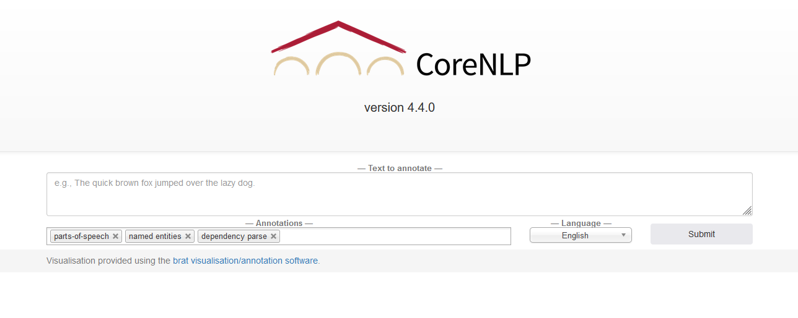
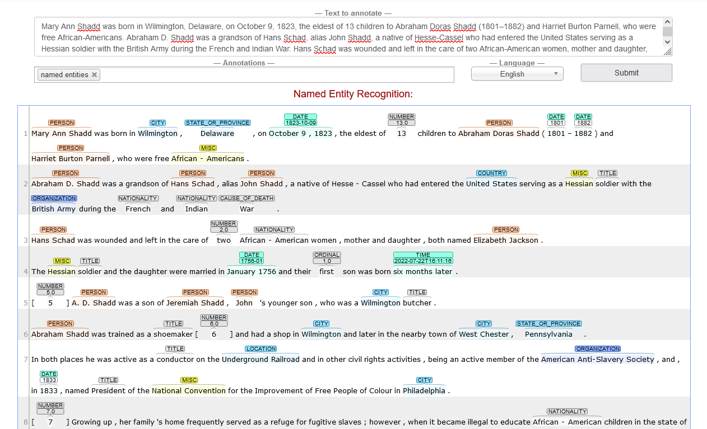

# How Does Named Entity Recognition (NER) Work?

## Recognizing named entities in texts

Named entity recognition (NER) identifies features of interest - such as names of people, places and organizations, in addtion to dates, currency and other special categories of nouns - within language data (e.g. unstructured text).

The best way to grasp NER is to try it out! Visit the [CoreNLP demo](https://corenlp.run/) and paste a short passage of text containing at least some proper names into the "-- Text to annotate --" field (the maximum number of characters in the online demo is 5000).

Remove the "parts-of-speech" and "dependency parse" options from the "-- Annotations --" field to limit our results to named entities and submit the text for analysis.

In the screenshot above, CoreNLP has annotated the text from a [Wikipedia article](https://en.wikipedia.org/wiki/Mary_Ann_Shadd) on the American-Canadian anti-slavery activist Mary Ann Shadd, tagging words (tokens) with labels like "Person," "Country," "Organization," and "Date." 

Although we can appreciate the utility of CoreNLP annotations in analyzing texts, the 5000 character maximum of the web-based version makes it impractical to scale up for larger corpora. You can download the full version of [CoreNLP](https://stanfordnlp.github.io/CoreNLP/) to experiment with but we will be using a different NLP tool, SpaCy, for the lesson.

## A quick introduction to the NLP workflow (pipeline)

How does an NLP tool like CoreNLP or SpaCy go about identifying named entities within an unstructured text corpus, then? If you have ever gone through the intellectual exercise of considering how to tell a computer to do a simple task (for humans) - like make toast - you quickly discover that much of what is implicit in our own cognitive processes ("verify toaster is plugged in") must be articulated in a programmatic manner. NER is no different, requiring a number of preparatory steps before it can be performed.   

### Tokenization

Most computational text analysis methods, including NER, first involve tokenizing the data - or segmenting the text into tokens based on the position of whitespace characters - so that each word can be examined individually. If you completed the “[Pre-processing Digitized Texts](https://scds.github.io/text-analysis-1)” workshop, you manually tokenized a text document in OpenRefine to make it possible to correct multiple errors with one operation. When performing computational text analysis, tokenization is done by the natural language processing system.

Once we can approach texts at the level of the word, other processing tasks in the text analysis workflow can then be performed such as:

### Stop word removal

Commonly used words - like *the*, *of* and *its* in the English language - are typically filtered out from the corpus for the sake of efficiency because they are not likely to be of interest. With many NLP tools, it is possible to either add stop words that you may wish to ignore in your analysis or omit existing stop words from the list which are, in fact, relevant to your analysis.

### Part of speech (PoS or POS) tagging

PoS tagging is a form of annotation that evaluates each word to determine its correspondence to grammatical parts of speech such as nouns, pronouns, verbs, adverbs, adjectives and so on. Unlike the previous two tasks, which can be explicitly programmed with formal rules - like "create a new token each time a whitespace character is encountered" - PoS tagging and the other tasks that follow rely instead on machine learning to make generalized predictions about what tag is most appropriate. For example, whether "saw" is a verb or a noun given its context. 

NLP tools use trained language models to make their predictions, which are "taught" through many examples of the various categories being modelled. Often - and in the current lesson - you will be working with a model trained by someone else, like the developers of the tool. It is usually possible - if time-consuming - to train your own model if the tool's supplied model is inadequate for your purposes. 

As we might expect, how the tool arrives at its predictions can be utterly opaque to the user; we will discuss training data bias further in "[Behind the Interface](behind.html)." 

### Stemming or lemmatization

A word can be expressed in different forms; for example, pluralized nouns (“pickle”, “pickles”) or conjugated verbs (“pickling”, “pickle”, “pickled”). Although we humans recognize that they are variations the same word, a computer must be instructed to regard them as such. For the purposes of being able to compare like with like, many NLP workflows involve reducing words to their root form, or *lemma*.

There are two approaches to the task of determining the lemma of a word in NLP:
* stemming, a faster but more error-prone technique that works by chopping off the end of a word in the hopes that it will achieve the intended goal most of the time, and
* lemmatization, which uses a vocabulary and performs morphological analysis to more accurately identify the lemma

> ***Trade offs: Speed Vs. Accuracy***

> As we get more familiar with the NLP workflow, we will encounter various concessions that developers make in designing their tools to increase the speed or maximize the efficiency of processes. For example, with respect to tokenization: we know that a space does not necessarily indicate the beginning of a new word but creating a comprehensive list of exceptions in various languages would be very time-consuming. Indeed, in the "[Pre-Processing Digitized Texts](https://scds.github.io/text-analysis-1/output.html)" lesson, we discussed setting the bar for accuracy relatively low because it would take too long to correct every error.
> Accuracy is not the only feature traded off for speed or efficiency in the design of computer programs and algorithms. The Python library we will be using for the lesson, SpaCy, limits the choices we have in how to approach the NLP workflow by making decisions for us in order to optimize for speed. Most troubling is the privileging of efficiency over equity - whether it is done consciously or unconsciously - by not involving minoritized groups in the design process, by assuming that the user shares the dominant subject position of the developer, by not taking the time to assemble fully representative training datasets and so on.   

### Dependency parsing

Examining individual tokens in isolation can obscure crucial contextual information. Dependency parsing infers syntactic relationships between tokens, whic ; for example, tokenization would undermine the semantic connection between “New” and “York” but parsing can merge tokens that have been over-segmented.

Some of the tasks above may depend on others, meaning that the order of operations matters. The lemmatization component of a workflow is aided by knowing whether “saw” is a verb or a noun from the PoS tagging task. Likewise, PoS tagging - which identifies proper nouns - can help the NER step focus on a subset of tokens. At the same time, dependency parsing happens after NER in the CoreNLP pipeline while SpaCy performs dependency parsing before NER.

Not all tasks may be performed in a given NLP workflow or in the same order, and NLP systems can use different rules to perform them. The same analytical technique may therefore not return the same results across several NLP tools. As part of your analysis, then, consider comparing the tagged entities produced by multiple tools (e.g. SpaCy, NLTK and CoreNLP) with a small sample from your corpus. Although it will take a bit of time to get familiar with each tool, you can avoid the deflating experience of finding out that there may have been a better tool for your task after processing gigabytes of language data! 

## Classifying named entities

Imagine writing a rule-based program that provides specific instructions on how to identify named entities.

With all the moving parts in the NLP workflow - the component tasks of PoS tagging, dependency parsing, NER and so on -  

 
Next --> [Installing SpaCy](install.html)
