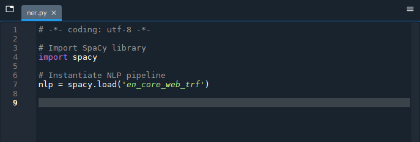
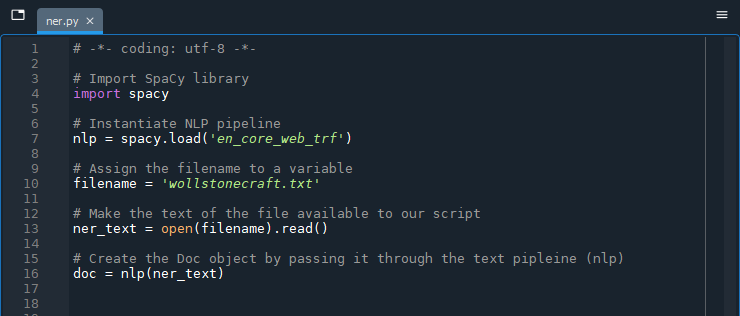
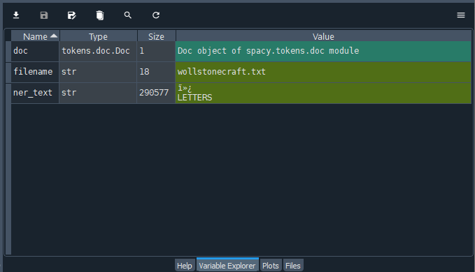
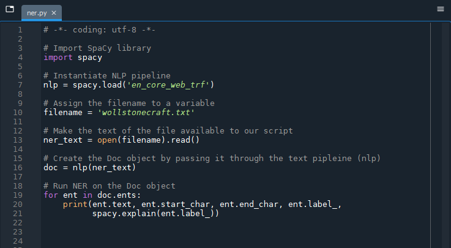
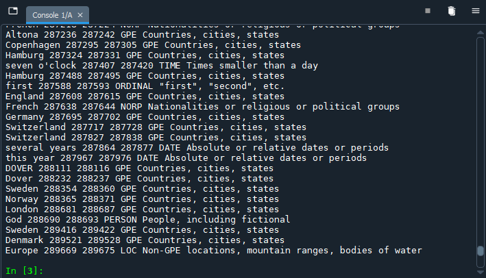

# Creating the Doc Object

SpaCy takes an object-oriented approach to NLP instead of treating text as strings the way NLTK does. With Spacy, the `Doc` object contains a sequence of `Token` objects. The `Language` class is a text processing pipeline that contains resources like a shared vocabulary and the various workflow components, and is used to create the `Doc` object from text (usually via the *nlp* variable). The `Doc` object is what we work with when we ask SpaCy to return candidates for named entities (`ents`), as an example. We will come across these concepts as we write our Python script. 

## Set up the environment

Before we start working with SpaCy, we will first save the Python script in Spyder (File > Save or `Ctrl` / `cmd` + `S`). Spyder will choose a default location which you can change if you would like to keep your Python scripts in an easier-to-locate spot. Going forward, Spyder will continue to save any new files to the folder you choose. You can choose your own name for the Python script, but we will refer to it as "ner.py" for consistency.

**IMPORTANT**: Move the "wollstonecraft.txt" file and any other text files you may be working with to the same directory (folder) as the Python script you are creating. While not a best practice from a file management standpoint, it simplifies having to specify the file path in our script for the purposes of the lesson.

## Process the text

Although we have installed the SpaCy library, we need to let Python know to call it up for our use. Just as downloading all Python packages would result in a giant file size, so too would loading them all at once slow Python down to an imperceptible crawl.

Copy and paste the code below in the ner.py file, or write it out for additional practice. If you receive an error when you run the code in the console, compare what is in your file with the code below - programming languages are very particular!

```

# Import SpaCy library
import spacy

# Instantiate NLP pipeline object
nlp = spacy.load('en_core_web_trf')

```



Next, we create the `Doc` object as described earlier from the contents of the "wollstonecraft.txt" file and assign it to the *doc* variable.

```

# Assign the filename to a variable
filename = 'wollstonecraft.txt'

# Make the text of the file available to our script
ner_text = open(filename).read()

# Create the Doc object by passing it through the text pipleine (nlp)
doc = nlp(ner_text)

```



If you would like to work with your own documents, simply change the *filename* variable to the name of your text file (verifying that it is also in the same folder as the ner.py script).

Run the script (`F5`) and note the results in the console. Nothing much will happen but let us have a look at the top-right pane in Spyder that we have been ignoring thus far. Select the "Variable Explorer" tab and notice that we have three variable names and associated values: "doc," "filename" and "ner_text" that we created by running the script.



Checking the status of our variables let us know that we have successfully connected to our document, as evidenced by the *filename* and *ner_text* variables, and that we have a `Doc` object, *doc*, to work with.

> ***Known issue***
> 
> In the console, you may occasionally receive warnings that "CUDA \[device] is not available" which is [a known issue with the transformer pipeline (*en_core_web_trf*)](https://github.com/explosion/spaCy/discussions/9571). You can safely disregard it so long as your script is still working correctly. You can avoid the error by installing and using the *en_core_web_lg* language model instead, but its accuracy in recognizing named entities is slightly lower.

We are now ready to run named entity recognition:

```
# Run NER on the Doc object
for ent in doc.ents:    
    print(ent.text, ent.start_char, ent.end_char, ent.label_, spacy.explain(ent.label_))
```


When running the code in the console, be patient! It will likely take a few minutes for your results to appear but they will evenutally print out in the console. You should have a long list of named entities. The code above helps us to interpret the rest of the line:

1. The name of the entity (`ent.text`)
2. The character number where the named entity starts, relative to all the characters in the document (`ent.start_char`)
3. The character number where the named entity ends, relative to all the characters in the document (`ent.end_char`)
4. The entity type code, based on the  (`ent.label_`)
5. An explanation of the entity type code (`spacy.explain(ent.label_)`)



You can, of course, omit some of the values from your `print` request if you would like to speed up the process.
 

We can print named entities, but the output is not particularly user-friendly. Our next step is to visualize the entities.


<br />
Next --> [Visualizing Named Entities](visualize.html)

