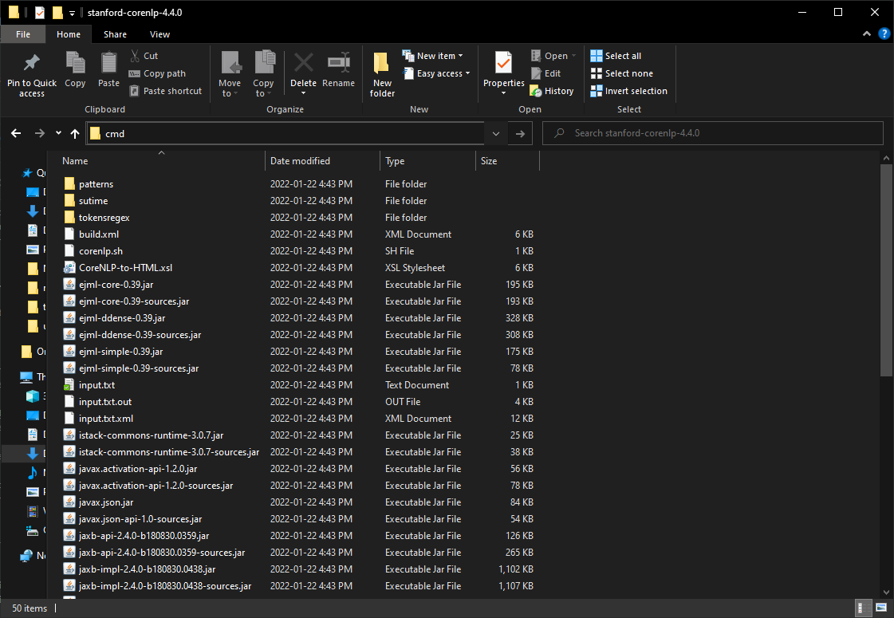

# Other Tools for Named Entity Recognition

As mentioned in the lesson, SpaCy is not the only NLP game in town! Numerous other tools exist that include NER components. They may approach the question of how to identify named entities similarly and even employ the same algorithms but the annotated output can vary between tools based on design decisions made by developers, the representativeness (or lack thereof) of the training data and so on.

If you will be working with a large number of documents, you may wish to investigate other tools with a small sample from your corpus before getting into more advanced (i.e. time-consuming) features of SpaCy in the event that another tool is more suitable for your purposes "out of the box."

The list below is not comprehensive - in fact, it is barely a list! - but they are relatively quick to set up and robustly supported.

<div markdown="1" style="border: 1px solid #7a003c; border-radius: 6px; margin-bottom: 1em; padding: 0.5em 1em 0; margin-top: 1em;" class="toc">
<summary style="cursor:default; display: block; border-bottom: 1px solid #302d36; margin-bottom: 0.5em">
  Tools
</summary>
- [CoreNLP](#corenlp)
- [Natural Language Toolkit (NLTK) - Python](#nltk)
</div>

## CoreNLP {#corenlp}

### Grapical interface (GUI) option

At the beginning of the workshop's lesson, we tried the hosted version of CoreNLP to get a better grasp of NER. CoreNLP can also be downloaded and run as a web server on your local machine, similarly to the displaCy server we used in the lesson. 

After [downloading CoreNLP](https://stanfordnlp.github.io/CoreNLP/download.html):
1. unzip the archive (`.zip` file),
2. navigate one level down to the folder containing the CoreNLP application (currently "stanford-corenlp-4.4.0") and, 
3. open a terminal from the folder. 

To open a folder in the terminal on a Mac, right click on the "stanford-corenlp-4.4.0" folder and select "Open in Terminal" from the menu. With a Windows OS, navigate one step further into the application itself and type "cmd" into the address bar:



Copy and paste the following command to the terminal:

```bash
java -mx4g -cp "*" edu.stanford.nlp.pipeline.StanfordCoreNLPServer -port 9000 -timeout 15000
```

After you hit `Enter` / `Return`, you should receive a message that the server is starting. As with the displaCy server, we will open a web browser to access the server but instead use the URL `localhost:9000` as the address. You will be presented with the same interface as the demo we used in the workshop's lesson.

The locally hosted version of the CoreNLP server has a much larger character limit than the hosted CoreNLP demo - 100,000 vs 5,000 - but it will likely still be too limited for all but the shortest of documents. It does, however, give us a quick basis for comparison. In visualizing the preface to "Letters Written During a Short Residence in Norway, Sweden and Denmark" from our "wollstonecraft.txt" file, there are some evident differences in the labels used (such as "title" and "duration") as well as how entities are labeled. For example, "Kingston" *is* recognized by CoreNLP as a location and "Earl" as a title (although technically more correct, from a semantic perspective: the "Earl of Kingston" is a person).

If you find that CoreNLP does a better job of labeling entities for your purposes, you can use the command line version of CoreNLP (below) to process more language data at once.

### Command line interface (CLI) option

Running CoreNLP From the command line allows you to work with larger documents or batches of documents. You can read more about [how to use CoreNLP from the command line](https://stanfordnlp.github.io/CoreNLP/cmdline.html) in the CoreNLP documentation.

As with our SpaCy script, if you would prefer to avoid specifying a file path, move a copy of the document you will be processing to the "stanford-corenlp-4.4.0" folder. You may need to allocate more memory to CoreNLP to run a document or corpus the size of "wollstonecraft.txt" (~90 pages) by adding `-Xmx4g` or `-Xmx6g` before `-cp` in the command to run CoreNLP - if you happen to have 4GB or 6GB of processing resources to draw from. 

There are numerous [output options](https://stanfordnlp.github.io/CoreNLP/cmdline.html#output) available with CoreNLP; as an example, a text document using the <a href="data/wollstonecraft-processed.txt" download>sample data from the workshop's lesson</a>. You may wish to experiment with [BRAT](https://github.com/nlplab/brat), the visualizer that the CoreNLP hosted demo uses.

## Natural Language Toolkit (NLTK) - Python {#nltk}

NLTK has a classifier component trained to recognize named entities. You can [read more about it](https://www.nltk.org/book/ch07.html#tab-ne-types) in the NLTK documentation. The function, `nltk.ne_chunk()`, outputs text with annotations.
