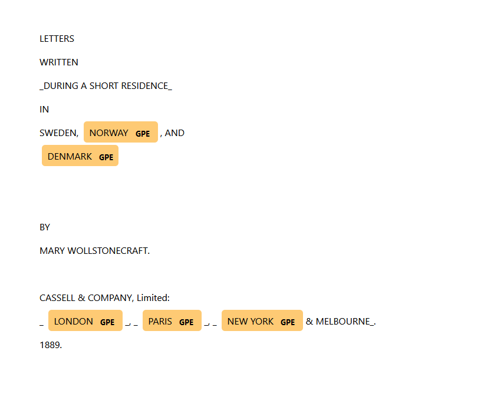
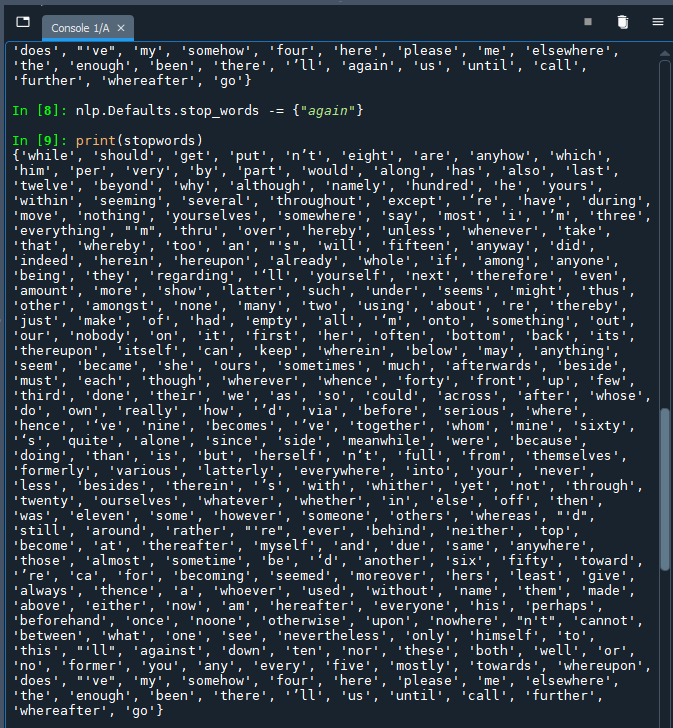
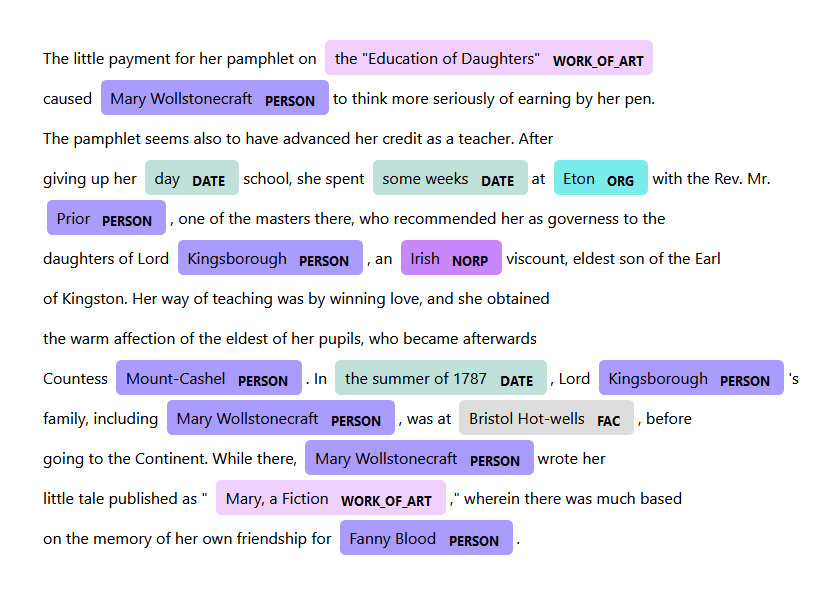
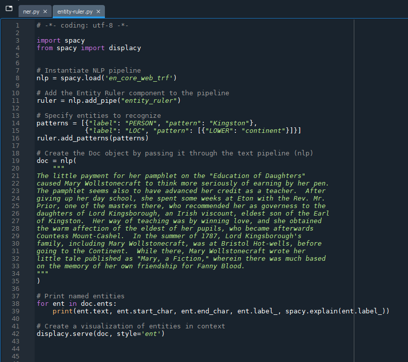
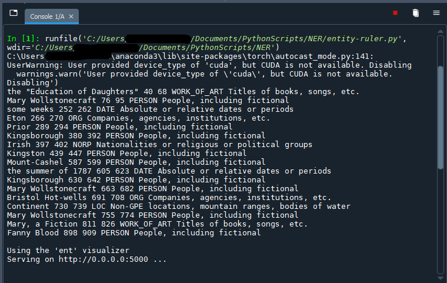
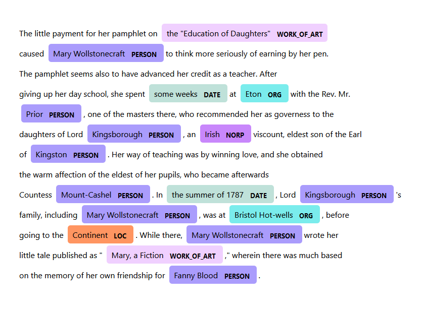

# 5. Fine-tuning SpaCy (Optional)

Although SpaCy does a fairly reliable job of recognizing named entities, it falls short of being perfect. In fact, the first few lines of the "wollstonecraft.txt" document, when visualized with displaCy, contain several obvious named entities - "SWEDEN", "MARY WOLLSTONECRAFT", "CASSEL & COMPANY Limited" and so on - that SpaCy has overlooked. And yet, SpaCy is able to recognize those same entities at other points in the document. 



Although we can expect - and tolerate - a small margin of error as implied by an accuracy score of 0.90 for the *en_core_web_trf* language model, there are steps we can take in our script to fine-tune our results. 

<div style="max-width:1140px"><div style="position:relative;padding-bottom:56.228070175439%"><iframe id="kmsembed-1_g71shs33" width="1140" height="641" src="https://www.macvideo.ca/embed/secure/iframe/entryId/1_g71shs33/uiConfId/39241881" class="kmsembed" allowfullscreen webkitallowfullscreen mozAllowFullScreen allow="autoplay *; fullscreen *; encrypted-media *" referrerPolicy="no-referrer-when-downgrade" sandbox="allow-forms allow-same-origin allow-scripts allow-top-navigation allow-pointer-lock allow-popups allow-modals allow-orientation-lock allow-popups-to-escape-sandbox allow-presentation allow-top-navigation-by-user-activation" frameborder="0" title="Kaltura Player" style="position:absolute;top:0;left:0;width:100%;height:100%"></iframe></div></div>

<hr />

Jump to step >

[5.1. Remove stopwords from SpaCy's default list]

[5.2. Create a new sample code script]

[5.3. Add the *EntityRuler* to the NLP pipeline]

[5.4. Specify named entities for SpaCy to recognize]

[5.5. Create the *Doc* object with a text string]

[5.6. Test the *EntityRuler* rules]

<hr />

## Restoring stop words

Stop words, as mentioned earlier in "[How Does NER Work?](ner.html)", are commonly occurring words that SpaCy ignores when recognizing named entities the `Doc` object. 

[A full list of stop words](https://github.com/explosion/spaCy/blob/master/spacy/lang/en/stop_words.py) is listed on SpaCy's GitHub repository. There may, however, be cases in which we want to preserve the stop words within the corpus if they may belong to named entites.

<hr />

### **5.1.** Remove stopwords from SpaCy's default list

You can remove stopwords from SpaCy's list by including the code below in your ner.py script after the NLP pipeline is instantiated (ensure that you wrap the term in quotation marks to indicate a string literal, or text that is to be treated as text and not as code). Alternatively, type the code directly in the console if you have already run the ner.py script at least once, creating the `nlp` variable referred to in the command:

```
nlp.Defaults.stop_words -= {"again", "anyhow"}
```

Verify your results by typing into the console, which creates a variable called "stopwords" that contains SpaCy's stopwords:

```
stopwords = nlp.Defaults.stop_words
```

Followed by a command to print the contents of the *stopwords* variable:

```
print(stopwords)
```

When you print the list of stop words, you should now observe that the terms in the curly brackets no longer appear - for example, "again" in the example pictured below.



## Adding entity names

SpaCy's language models are trained on texts from the web: news articles, blog posts and comments. If the contents of your corpus do not orginate from the web, such as 19th-century abolitionist correspondence, you might find SpaCy's language models less useful for NER. Even when your corpus is made up of tweets, you may still find that SpaCy misses or mis-classifies some entities.

If there are proper names relevant to your analyis, you can use SpaCy's *EntityRuler* pipeline component to signal that they should be recognized. The *EntityRuler* allows you to create rules to label specific entities with the entity type of your choosing. Recall that SpaCy uses machine learning rather than a formal set of rules to recognize named entities, but we can fine-tune our results with rule-based commands.

It can take some experimentation to arrive at the correct pattern to capture the named entity you would like to recognize, so you may want to start a new script with a much smaller amount of text that can be processed more quickly than the entire "wollstonecraft.txt" document.

<hr />

### **5.2** Create a new sample code script

In Spyder, create and save a new Python file; the file should save to the same directory as the previous ner.py file.

We will begin the script by importing the SpaCy library. As we will want to visualize our results, we will also need to call displaCy:   

```
import spacy

# Instantiate NLP pipeline
nlp = spacy.load('en_core_web_trf')
```

<hr />

### **5.3.** Add the *EntityRuler* to the NLP pipeline

After importing SpaCy and instructing the NLP pipeline to use the *en_core_web_trf* language model, we will now invoke the entity ruler component:

```
# Add the EntityRuler component to the pipeline
ruler = nlp.add_pipe("entity_ruler")
```

<hr />

### **5.4.** Specify named entities for SpaCy to recognize

Next, we will create a rule to ask SpaCy to annotate a certain pattern of characters with an entity type label. In the visualization of the "wollstonecraft.txt" document, you likely noticed some missed entities. For example, "the Earl of Kingston" is not labelled as a person, or even as a place.



For further practice, we will also annotate "Continent" with the location entity type. SpaCy's *EntityRuler* component accepts strings ("Kingston") and tokens ("LOWER": "continent") as patterns.

```
# Specify named entities to recognize
patterns = [{"label": "PERSON", "pattern": "Kingston"}, 
            {"label": "LOC", "pattern": [{"LOWER": "continent"}]}]
ruler.add_patterns(patterns)
```

The "LOWER" attribute of the *Token* object contains the lowercase version of the token. You can search for multi-token entities by expanding the list: `"pattern": [{"LOWER": "san"}, {"LOWER": "francisco"}]`. [Other *Token* attributes](https://spacy.io/api/token#attributes) are described in the SpaCy documentation.
 
<hr />

### **5.5.** Create the *Doc* object with a text string

Now that we have our pipeline fully set up, we can create the *Doc* object. In the ner.py script, we wrote code to open a text file whose contents we passed to the `doc` variable. In fact, SpaCy does not require text to come from a file - you can also assign a string of text to the *Doc* object.

```
# Create the Doc object by passing it through the text pipeline (nlp)
doc = nlp(
    """
The little payment for her pamphlet on the "Education of Daughters"
caused Mary Wollstonecraft to think more seriously of earning by her pen.
The pamphlet seems also to have advanced her credit as a teacher.  After
giving up her day school, she spent some weeks at Eton with the Rev. Mr.
Prior, one of the masters there, who recommended her as governess to the
daughters of Lord Kingsborough, an Irish viscount, eldest son of the Earl
of Kingston.  Her way of teaching was by winning love, and she obtained
the warm affection of the eldest of her pupils, who became afterwards
Countess Mount-Cashel.  In the summer of 1787, Lord Kingsborough's
family, including Mary Wollstonecraft, was at Bristol Hot-wells, before
going to the Continent.  While there, Mary Wollstonecraft wrote her
little tale published as "Mary, a Fiction," wherein there was much based
on the memory of her own friendship for Fanny Blood.
"""
)
```

Earlier, we used triple quotes to comment out multiple lines of code. When we assign the text within the triple quotes to a variable, however, it is no longer ignored by the console and instead becomes a multi-lined string that is passed to the variable. Above, we have limited to the scope of our text to a paragraph which should shorten our wait time for results considerably!

<hr />

### **5.6.** Test the *EntityRuler* rules 

Lastly, we will print the named entities within the paragraph to verify our work. We can reuse the code from our ner.py script:

```
# Print named entities     
for ent in doc.ents:    
    print(ent.text, ent.start_char, ent.end_char, ent.label_, spacy.explain(ent.label_))
```



Save the file and run the code (`F5`) to test out the script. The named entities should appear fairly quickly in the console, and remember to visit [http://localhost:5000/] in your web browser to access the visualization.





If the script worked, we should see the results in both the console output and the displaCy visualization in our web brower. Having had success with a small sample of the text that we could run very rapidly, we can now write it into our longer ner.py script.


<hr />

If you have a large number of named entities to manually label, you can create the patterns in a JSON file and upload to the NLP pipeline [as described in SpaCy's documentation](https://spacy.io/usage/rule-based-matching#entityruler-files). You may find, though, that you reach a point of diminishing returns wherein it might be less time-consuming to train your own NER pipeline component (see below).

## Optimizing the NLP pipeline for efficiency, training your own models and more

There are other ways you can exercise a greater degree of control over the NER process in SpaCy, such as omitting components from the NLP pipeline and training your own models. Because they are more involved than what could be considered fine-tuning, we will not cover them in the workshop but encourage you to consult the SpaCy documentation if your use case might require them.

* [Exclude NLP components from the (transformer) pipeline](https://spacy.io/models#design-trf) 
* [Expanding named entities](https://spacy.io/usage/rule-based-matching#models-rules-ner), to address named entities that SpaCy clips
* [Training your own language model](https://spacy.io/usage/training), if web-based content is not an adequate representation of your language data
* [Training a custom entity linking model](https://spacy.io/universe/project/video-entity-linking/) to normalize or disambiguate entities


<br />
Next --> [Other NER Tools](tools.html)
