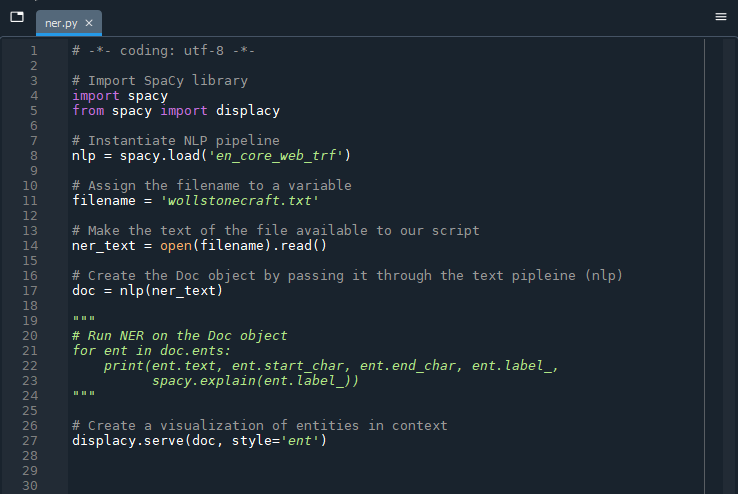
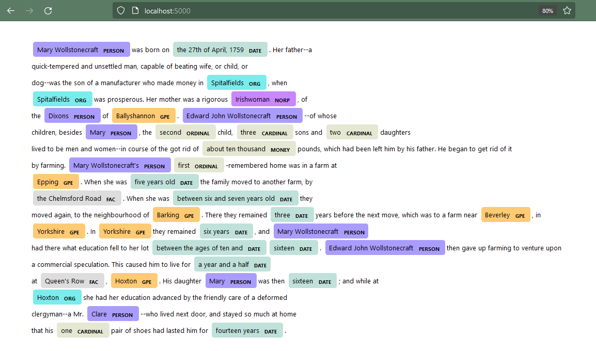
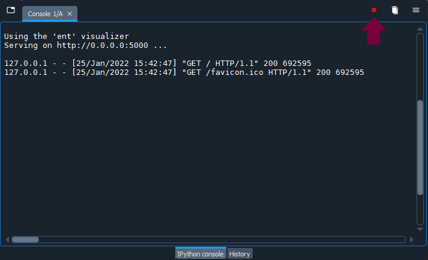
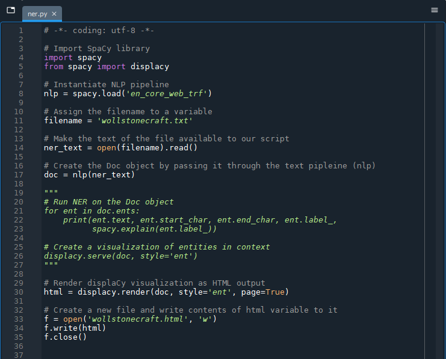

# 3. Visualizing Named Entities with SpaCy

To render the output from SpaCy in a form more amenable to analysis, we will use SpaCy's built-in visualizer: *displaCy*.

<div style="max-width:1140px"><div style="position:relative;padding-bottom:56.228070175439%"><iframe id="kmsembed-1_tkfgh74a" width="1140" height="641" src="https://www.macvideo.ca/embed/secure/iframe/entryId/1_tkfgh74a/uiConfId/39241881" class="kmsembed" allowfullscreen webkitallowfullscreen mozAllowFullScreen allow="autoplay *; fullscreen *; encrypted-media *" referrerPolicy="no-referrer-when-downgrade" sandbox="allow-forms allow-same-origin allow-scripts allow-top-navigation allow-pointer-lock allow-popups allow-modals allow-orientation-lock allow-popups-to-escape-sandbox allow-presentation allow-top-navigation-by-user-activation" frameborder="0" title="Kaltura Player" style="position:absolute;top:0;left:0;width:100%;height:100%"></iframe></div></div>

<hr />

Jump to step >

[3.1. Comment out previous code](#31-comment-out-previous-code)

[3.2. Import displaCy](#32-import-displacy)

[3.3. Visualize named entities in a web browser](#33-visualize-named-entities-in-a-web-browser)

[3.4. Send displaCy's visualization to an HTML file](#34-send-displacys-visualization-to-a-static-html-file)

[3.5. Create a dependency visualization with displaCy (optional)](#35-create-a-dependency-visualization-with-displacy-optional)

## Using the displaCy server

DisplaCy uses JavaScript, SVG and CSS - web programming and design languages - to render visualizations of entities and dependencies in a web browser.

<hr />

### **3.1.** Comment out previous code

To begin, we will comment out the code we previously wrote which printed entities to the console as we do not need it at the moment. You can precede each of the lines with the "#" symbol or you can wrap the three lines of code in triple-quotes as demonstrated in the example below. We are not *technically* commenting out the code but we are turning it into a string that Python will ignore. 

```
"""
# Run NER on the Doc object
for ent in doc.ents:    
    print(ent.text, ent.start_char, ent.end_char, ent.label_, 
          spacy.explain(ent.label_))
"""
```

<hr />

### **3.2.** Import displaCy

Next, we will import displaCy just as we did with the SpaCy library. Under our initial import statement, add `from space import displacy`:

```
# Import SpaCy library
import spacy
from spacy import displacy
```

<hr />

### **3.3.** Visualize named entities in a web browser

With displaCy imported, we can now make use of it to visualize named entities by adding the following lines of code to the end of our ner.py script:

```
# Create a visualization of entities in context
displacy.serve(doc, style='ent')
```



DisplaCy will start up a simple web server on your local machine to produce a visualization that you can access through your web browser.

> ***MacOS Monterey Users***
> 
> In the Monterey version of the MacOS (12+), the 5000 port to which displaCy serves is used by the AirPlay receiver. You can opt to skip to step 3.4 to produce a file with the same contents that served to the web browser.  
> 
> Alternatively: if you wish to try the displaCy server, before running the script you will need to "free up" the localhost address so that the console can make use of it. You can stop the AirPlay Receiver process by going to System Preferences \> Sharing and uncheck "AirPlay Receiver" for as long as you need the displaCy server. Turn the AirPlay Receiver back on when you are done (if you use AirPlay). 
>  

Instead of running the whole script, we will again just run parts of it by selecting the relevant lines of code and using the shortcut key `F9`. Remember to run the code that imports displaCy (`from spacy import displacy`) before asking it to create a server (`displacy.serve(doc, style='ent')`) or you will get an error message. 

Wait until the console returns:

> Using the 'ent' visualizer
> 
> Serving on http://0.0.0.0:5000 ...

When the server is ready, open a web browser and go to the following URL:

```
http://localhost:5000/
```

You should now have a web page with the contents of the "wollstonecraft.txt" document marked up to show named entities.



## Interpreting the results

Some of the named entity labels may be obvious - such as PERSON - but others are more esoteric. If you would like to see the full list of entities that SpaCy recognizes, type the following command in the console:

```
print(nlp.pipe_labels['ner'])
```

It will return a list of 18 entity types:

| Entity Type | Type Description |
| ----------- | ---------------- |
| CARDINAL | Numerals that do not fall under another type |
| DATE | Absolute or relative dates or periods |
| EVENT | Named hurricanes, battles, wars, sports events, etc. |
| FAC | Buildings, airports, highways, bridges, etc. |
| GPE | Countries, cities, states |
| LANGUAGE | Any named language |
| LAW | Named documents made into law |
| LOC | Non-GPE locations, mountain ranges, bodies of water |
| MONEY | Monetary values, including unit |
| NORP | Nationalities or religious or political groups |
| ORDINAL | "first", "second", etc. |
| ORG | Companies, agencies, institutions, etc. |
| PERCENT | Percentage, including "%" |
| PERSON | People, including fictional |
| PRODUCT | Objects, vehicles, foods, etc. (not services) |
| QUANTITY | Measurements, as of weight or distance |
| TIME | Times smaller than a day |
| WORK_OF_ART | Titles of books, songs, etc. |


In reviewing your results, you will likely notice some errors - named entities that SpaCy has missed or misclassified. Recall that the *en_core_web_trf* model has an accuracy evaluation score of about 0.90 - which is better than SpaCy's other trained English models, but not perfect!

## Stopping the displaCy server

The server that displaCy creates will continue to run until we stop the process in the console. To stop the command, use the small square icon at the top right of the console - which will be red when a command is running - or choose "Interrupt kernel" from the IPython console menu, or from Spyder's menu area: Consoles > Interrupt kernel.



**IMPORTANT:** remember to stop the server process in the console when you are done with it by interrupting the kernel. You will not be able to type any other commands in the active console while the console is running the server, though you can open a new console in Spyer (`Ctrl` / `cmd` + `T`) if you want to perform another task concurrently. 

## Outputting displaCy visualizations to HTML and SVG

### **3.4.** Send displaCy's visualization to a static HTML file

Although using the displaCy server may suffice for exploratory data analysis, you may want to create a more permanent representation to present or easily refer to later. Adding the next few lines of code to the end of your ner.py script will create an HTML file called "wollstonecraft.html" in the same directory as your Python script. 

```
# Render displaCy visualization as HTML output
html = displacy.render(doc, style='ent', page=True)

# Create a new file and write contents of html variable to it
f = open('wollstonecraft.html', 'w')
f.write(html)
f.close()
```
Comment out or delete the previous `displacy.serve` code as we do not need the server to create the file.



## Visualizing dependencies

### **3.5.** Create a dependency visualization with displaCy (optional)

To create a dependency visualization, simply substitute `'dep'` for `'ent'` in the style attribute:

```
html = displacy.render(doc, style='dep', page=True, minify=True)
```

<br />
Next --> [Identifying Key Terms](key.html)
